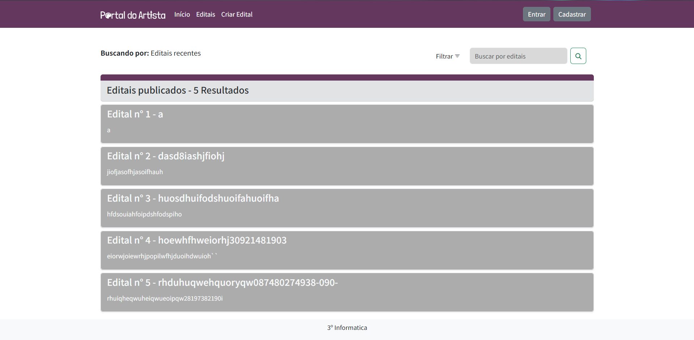

# Portal do Artista 🖌
Projeto para a disciplina de Linguagem de Programação II e Projeto Integrador II do curso técnico de Informática - IFPB

## Motivação
Num contexto cultural, artistas enfrentam dificuldades para expor seus trabalhos e ganhar a sua visibilidade, muitas vezes pela falta de patrocínios ou eventos de exposição.  
Sem o apoio devido do Estado (o que ocorre pela elitização de alguns dos recursos promovidos pelo governo, como é o caso da Lei Rouanet, ou pela falta de divulgação dos editais), artistas talentosos enfrentam dificuldades para encontrar recursos financeiros para financiar suas obras ou então possuem dificuldades para se cadastrar em novos editais e eventos que estejam acontecendo no momento.  
Surge então a necessidade de uma plataforma em que o Estado possa publicar editais e centralizar as informações sobre novos eventos e programas, na qual os artistas possam expor suas obras e trabalhos, se inscrever nos programas do governo, conectar-se com outros profissionais e encontrar oportunidades de colaboração.  
Este projeto visa preencher essa lacuna, proporcionando visibilidade e apoio à comunidade artística, ao mesmo tempo em que oferece uma maneira eficaz para o estado promover a cultura e as artes, além disso deve servir como um canal eficaz para o Estado promover a cultura e as artes, divulgando editais, concursos e programas de apoio financeiro.

## Módulos

## Módulo HOME
- **DASHBOARD ARTÍSTICO**
  - Total de editais abertos e prazos;
  - Principais eventos e exposições em destaque;
  - Novas oportunidades de patrocínio.
- **LOGIN**
  - Acesso para usuários cadastrados na plataforma, permitindo acessar funcionalidades específicas conforme seu perfil de artista, gestor cultural ou público geral.

- **CONTATO ENVIO DE DÚVIDAS, SUGESTÕES E ERROS**
  - Espaço dedicado para comunicação direta com a administração da
plataforma.

## Módulo CONSULTA DE EDITAIS
- **Visualização dos editais abertos**
  - Apresentação dos editais em mapa cultural;
  - Lista de editais com filtros aplicáveis.
- **Opções de FILTRO para consulta de Editais:**
  - Por categoria artística (música, teatro, dança, artes visuais etc.);
  - Por localização (cidade, estado);
  - Por período de inscrição;
  - Por tipo de apoio oferecido (financeiro, logístico etc.)

## Módulo ARTISTA
- **Acompanhamento de inscrições em Editais;**
- **Histórico de projetos submetidos;**
- **Alertas sobre prazos de entrega e resultados de seleções.**

## Módulo COLABORAÇÃO
- **Espaço para anúncio de projetos colaborativos;**
- **Ferramentas para conectar artistas e profissionais do setor cultural;**
- **Fóruns de discussão e troca de experiências.**

## Módulo EVENTOS
- **Divulgação de eventos culturais, exposições, workshops;**
- **Sistema de inscrição e emissão de ingressos para eventos;**
- **Calendário cultural personalizável pelo usuário.**

## Módulo ADMINISTRAÇÃO CULTURAL
- **Gestão de Editais: criação, publicação e acompanhamento;**
- **Organização e divulgação de eventos e exposições;**
- **Distribuição de recursos e apoio financeiro aos projetos selecionados;**
- **Comunicação direta com artistas e gestores culturais.**

## Grupo do Projeto
- Danilo
- Henrique
- Mateus Mendes
- Matheus Faelson
- Ricardo

Para salvar os dados foi utilizado o banco de dados "postgresql"

# Print das telas do sistema:
## Página inicial:

## Página de listar os editais:

